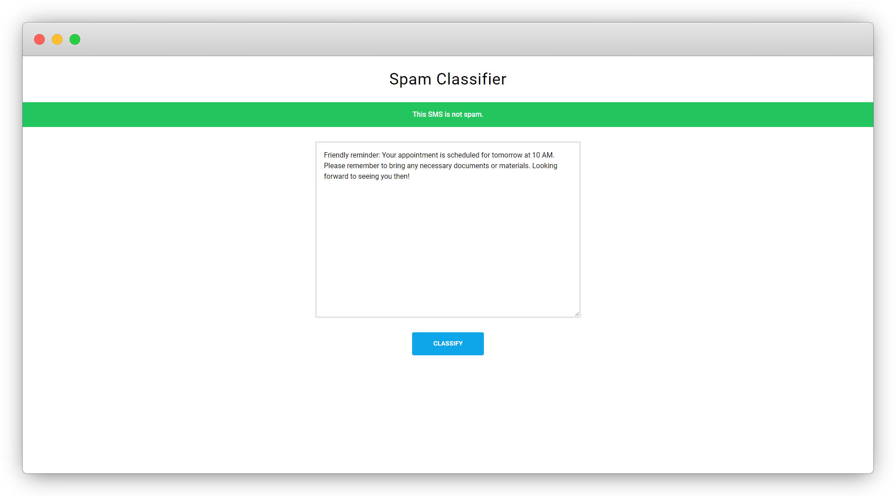
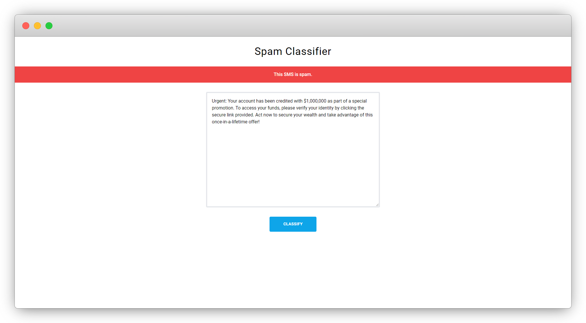

# Spam classifier

## Description

A spam classifier trained on the [SMS Spam Collection Data Set](https://www.kaggle.com/datasets/uciml/sms-spam-collection-dataset).

## Setup

1. Navigate to the `server` directory.
2. Run `npm install` to install the dependencies.
3. Run `npm start` to start the server.
